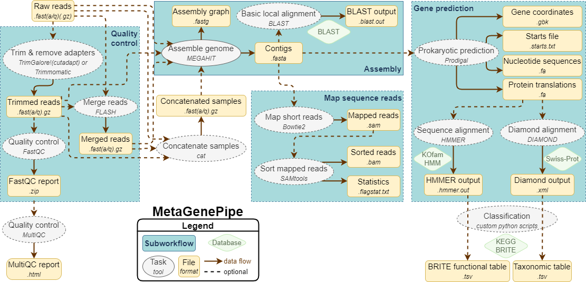

===============
Workflow
===============

- Flash: Lengthens reads
- Blast: Aligns contigs to Blast database
- Merge: Concatenates samples
- Taxon: Performs taxonomic assignment
- Trim Galore: Performs quality control for reads
- Read Alignment: Aligns reads to contigs
- HMMER: Performs brite analysis

The submodules of the workflow are configured in ``metaGenePipe.json``. The defaults are as follows:

.. code-block:: json

  "metaGenPipe.flashBoolean": true,
  "metaGenPipe.blastBoolean": false,
  "metaGenPipe.mergeBoolean": true,
  "metaGenPipe.taxonBoolean": true,
  "metaGenPipe.trimmomaticBoolean": false,
  "metaGenPipe.trimGaloreBoolean": true,
  "metaGenPipe.megahitBoolean": true,
  "metaGenPipe.readalignBoolean": true,
  "metaGenPipe.hmmerBoolean": true,

